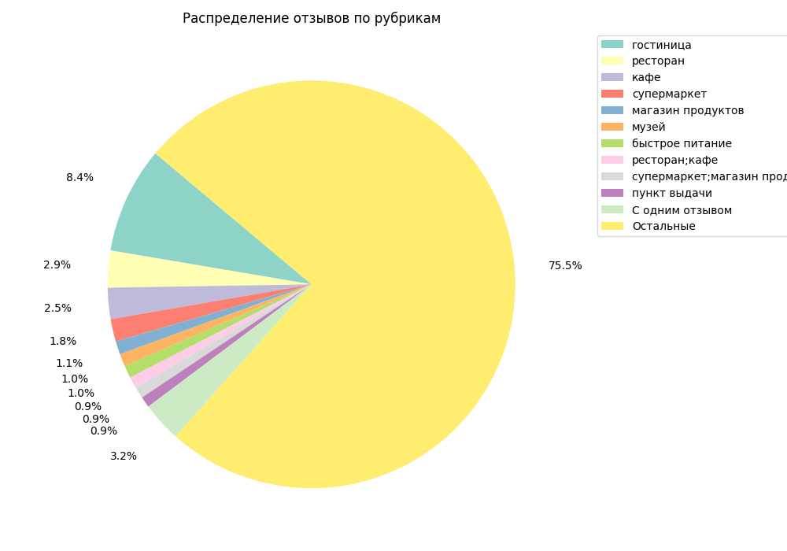
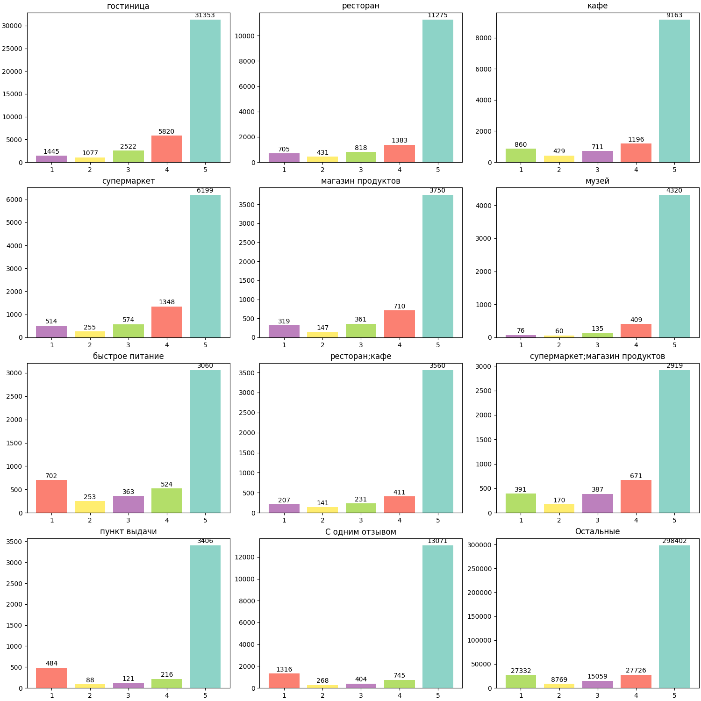
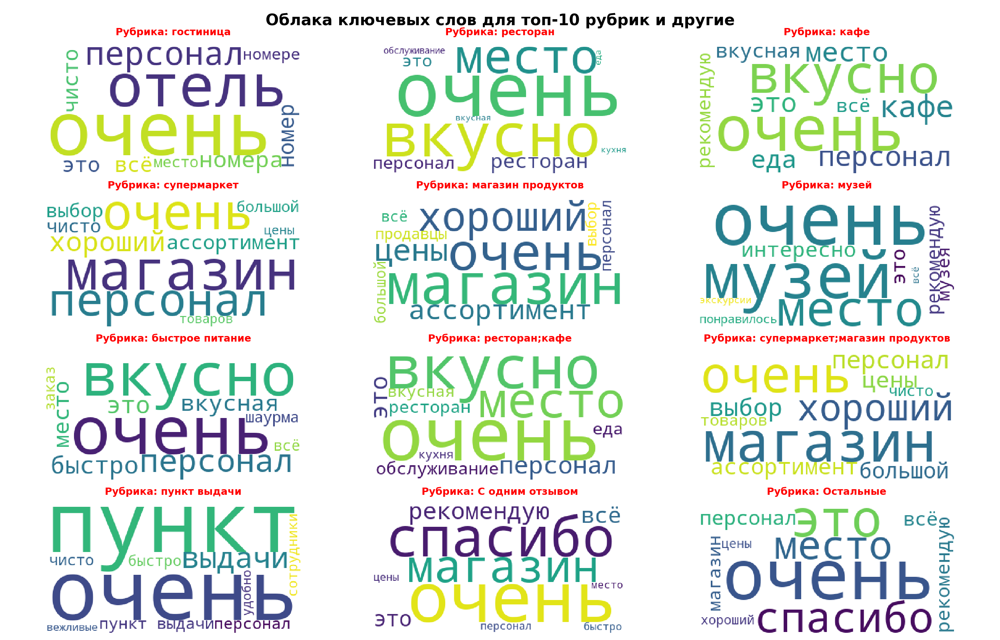
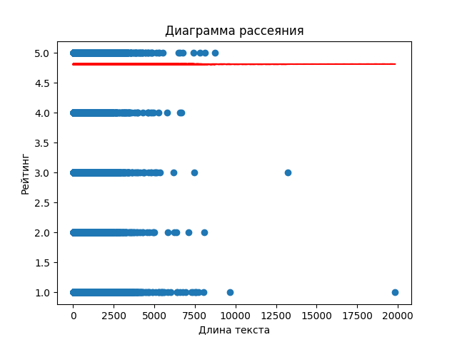

# Отчет по проекту

- Провести анализ данных.
- Создать как минимум 2 модели для генерации текстовые отзывов о различных местах на основе
  определенных входных параметров (категория места, средний рейтинг, название и адрес).

## Разведочный анализ данных (EDA)

- Посмотреть распределение отзывов по рубрикам и рейтингам.
- Определить ключевые слова, часто встречающиеся в отзывах.
- Подготовить данные для дальнейшего анализа и принятия бизнес-решений.

### Очистка.

- Было выявлено 970 записей с пустым названием места. Так как это очень много, отзывы не были удалены, но чтобы не оставлять пустое поле, введена пометка "нет" означающая что название не указано.
- Было удалено 38 записей, потому что у них длина текста отзыва была меньше 10 символов. Меньше 10 символов это очень мало информации для составления представления о месте.

### Статистика

Базовая статистика для теста отзыва:

- Среднее количество слов: 44
- Стандартное отклонение: 45
- Минимальное количество слов: 1
- Максимальное количество слов: 3019
- Медиана количества слов: 30

#### Вывод

- Большинство отзывов короткие, с медианным значением в 30 слов.

### Топ 10 рубрик

Топ 10 рубрик по количеству отзывов и их процентное соотношение:

1. гостиница - 42217 отзывов (8.45%)
2. ресторан - 14612 отзывов (2.92%)
3. кафе - 12359 отзывов (2.47%)
4. супермаркет - 8890 отзывов (1.78%)
5. магазин продуктов - 5287 отзывов (1.06%)
6. музей - 5000 отзывов (1.00%)
7. быстрое питание - 4902 отзывов (0.98%)
8. ресторан;кафе - 4550 отзывов (0.91%)
9. супермаркет;магазин продуктов - 4538 отзывов (0.91%)
10. пункт выдачи - 4315 отзывов (0.86%)

Очень много рубрик с одним отзывом, больше 3% от общего числа.

0. С одним отзывом - 15804 рубрик (3.16%)

Оставшиеся рубрики составляют 75% всех отзывов.

#### Вывод

- Основная категория "Гостиница", занимают большую долю всех отзывов, больше 8%. Остальные из топ 10 занимают от 3% до 1%. Очень много записей с только одним отзывом для рубрики, более 3%. Это очень много, поэтому если надо чтобы модель генерила отзывы для этой группы рубрик, надо либо добавлять веса для этих данных, либо добавить записей для этих рубрик.

### Распределение рейтингов

5.0    390478
4.0     41159
1.0     34351
3.0     21686
2.0     12088

#### Вывод

-  Очень много положительных отзывов. А с 5 в разы больше всех остальных. Явный дисбаланс в данных. Поэтому положитеьные отзывы будут генериться без проблем, для них очень много данных для обучения, а вот с негативными возможны проблемы. При обучении желательно это учитывать.

### Анализ рейтинга по топ 10 рубрикам, с 1 отзывом для рубрики и остальные

#### Вывод

- По всем группам больше всего отзываов с рейтингом 5. В некоторых рубриках отзывы с рейтингом 1 вырываются на 2 место после 5. В остальных порядок сохраняется и второе место занимают отзывы с рейтигом 4. Это говорит о неоднородности рейтинга для разных рубрик. Нет однозначноно соответствия.

### Извлечение ключевых слов

Использовался TF-IDF для извлечения ключевых слов из отзывов по рубрикам.

Облако ключевых слов для всех отзывов.

Облака ключевых слов в разрезе топ 10 рубрик, а также с 1 отзывом для рубрики и остальные.

#### Вывод

- Ключевые слова, извлеченные с помощью TF-IDF, помогают выявить ключевые слова каждого отзыва. 
- Так как в данных есть очевидный дисбаланс, положительных отзывов намного больше чем негативных, то в ключевых словах в основном присутствуют слова положительной эмоциональной окраски.

#### Длина отзыва и его рейтинг

#### Вывод

- Записей с короткой и средней длиной отзыва очевидно очень много, отзывов с действительно длинным тестом мало, также есть несколько выбросов с очень длинным тестом отзыва. Для генерации среднего отзыва данных вполне достаточно. Линия треда показывает что все-таки отзывов с рейтингом 5 очень много, и нет никакого развития зависимости, линия идет горизонтально между 4 и 5. Скорее всего большое количество длинных негативных отзывов оттягивает линию треда вниз от 5. 

## Модели

### Дообученная модель 

- Модель семейства RuGPT, разработанная для работы с текстами на русском языке. Базируется на архитектуре GPT-2.

#### Вывод

- Модель долго дообучается. Мне пока не удалось ее дообучить до полностью устраивабщего меня результата. Сейчас сгенерированные отзывы содержат ошибки. В начале текст идет осмысленым, но к концу появляются обрывки фраз и слов, случайные символы. Очевидно надо больше времени для обучения.

### Модель BiLSTM

Были рассмотрены 2 варианта токенизации входного текста для модели. Использовался токенизатор RuBERT и простой метод мешка слов. Методом мешка слов было очень сложно обучать модель так как словарь при таком постоении очень большой. Но и отзывы получаются более осмысленные. С декодером токенизатора RuBERT возникли проблемы, многие слова в сгенерированном отзыве получаются нечитаемые.

#### Вывод

- В обоих случаях не получаются осмысленные отзывы. Необходима дальнейшее обучение моделей, модели очевидно недообучены. Модель с мешком слов лучше справляется с заданием, так как в сгенерированных ею отзывах есть осмысленные фразы, хотя она обучалась всего на 0,5% от всех данных. Есть предположение, что если бы хватило ресурсов обучить ее хотя бы на больше 50% всех данных, то результаты были бы очень хорошими.

## Общие выводы

- Модель на основе уже обученной модели RuGPT очевидно показывает лучший результат. Модели построенные для генерации отзывов с нуля требуют очень больших ресурсов для обучения даже на таких сравнительно небольших данных. Для обучения такой сложной модели с нуля необходимы большие ресурсы. 

- В целом в сгенерированных отзывах встречается много положительных слов, даже если исходные данные были заданы с очень негативным рейтингом, сказывается перекос в данных в сторону положительных отзывов. Необходимо добавить балансировку в данные или веса чтобы модель смогла генерить также негативные отзывы.

